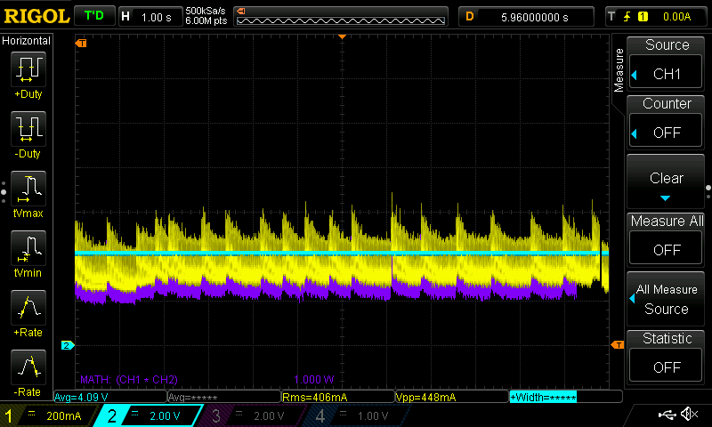

# Current Consumption in TrimUI Brick Followup

This is a continuation of previous current consumption testing done with a focus primarily on the contribution of the RGB LEDs, screen backlight, and WiFi.

The new testing included here focuses primarily on various device modes (off, sleep, etc) and in a limited selection of games and emulators.

For details on the initial test setup, methods, and results refer to the [initial Brick current consumption testing results](./Brick%20Current%20Consumption%20with%20NextUI.md).

See also [thermal testing results](./Brick%20Thermal%20Testing.md).

Unless otherwise noted, all LEDs are set to 0 brightness (off) screen brightness is at minimum, wifi is off, and a static menu item is selected. NextUI release 4.3.15.

## Table of Contents
- [Mode Testing](#mode-testing)
- [STOCK Testing](#stock-testing)
- [NextUI Menu Testing](#nextui-menu-testing)
- [In Game Testing](#in-game-testing)
- [CPU Stress Testing](#cpu-stress-testing)

## Mode Testing

Each of the device operating modes were tested.  The device has a 3000mAh (11.1Wh) battery.

| Mode             | Current (mA) | Estimated Battery Life (hours) |
|------------------|-------------|---------------------------|
| Off              | 0.057       | -                         |
| Suspended        | 6.7         | 447.8                     |
| On (screen off)  | 213         | 14.1                      |
| On (screen on)   | 232         | 12.9                      |

*Estiamated battery life was calculated by dividing the battery capacity (3000mAh) by the current. These are* ***ESTIMATES ONLY.***

If an unloaded self discharge rate of 2% per month for the battery pack is assumed, it translates to a self discharge "load" of ~.083mA. With this as a point of reference, the device's "Off" current draw is similar to the battery's self discharge rate. This is good, the device when fully powered down does not present a substantial standby load.

When in suspend mode, with a capacity of 3000mAh and a current draw of 6.7mA that works out to just over 18 days.

## STOCK Testing

For the measurements below I booted the device with the SDCARD removed so the device would boot into the stock OS. LEDs, wifi, etc were disabled and the screen brightness was set to minimum.

| Mode             | Current (mA) | Estimated Battery Life (hours) |
|------------------|-------------|---------------------------|
| Suspended        | 6.7         | 447.8                     |
| On (screen off)  | 270         | 11.1                      |
| On (screen on)   | 289         | 10.4                      |

*Estiamated battery life was calculated by dividing the battery capacity (3000mAh) by the current. These are* ***ESTIMATES ONLY.***

## NextUI Menu Testing

Selecting an item whose name is long enough to need to scroll the text has a notable impact on current consumption.  

| Menu Item | Current (mA) |
|-----------|-------------|
| Static    | 239         |
| Scrolling | 320         |

*Figure 3.1: Static menu item - Current consumption: 239mA*

*Figure 3.2: Scrolling menu item - Current consumption: 320mA*

## In Game Testing

A limited number of games were tested in the included emulators. All other settings were at defaults, LEDs disabled, screen minimum brightness, wifi off. In each game the measurement was taken while sitting on the game's title screen.

| Device                           | Emulator | Game                            | Nominal (mA) | Peak (mA) | Estimated Battery Life (hours) |
|----------------------------------|----------|--------------------------------|--------------|-----------|--------------------------------|
| Game Boy                         | GB       | Super Mario Land 2             | 313          | 339       | 8.9                           |
| Game Boy Advance                 | GBA      | Super Mario Advance 2          | 325          | 350       | 8.6                           |
| Game Boy Advance                 | MGBA     | Super Mario Advance 2          | 337          | 363       | 8.3                           |
| Game Boy Color                   | GBC      | Super Mario Bros. Deluxe       | 320          | 349       | 8.6                           |
| Nintendo Entertainment System    | FC       | Super Mario Bros               | 347          | 376       | 8.0                           |
| Super Nintendo Entertainment System | SFC      | Super Mario World (All Stars)  | 355          | 385       | 7.8                           |
| Super Nintendo Entertainment System | SUPA     | Super Mario World (All Stars)  | 385          | 400       | 7.5                           |

*Estiamated battery life was calculated by dividing the battery capacity (3000mAh) by the peak current. The peak value was used in an effort to NOT OVERESTIMATE, however these are* ***ESTIMATES ONLY.***

*Figure 4.1: Game Boy - Super Mario Land 2 - Nominal: 313mA, Peak: 339mA*

*Figure 4.2: Game Boy Advance (GBA) - Super Mario Advance 2 - Nominal: 325mA, Peak: 350mA*

*Figure 4.3: Game Boy Advance (MGBA) - Super Mario Advance 2 - Nominal: 337mA, Peak: 363mA*

*Figure 4.4: Game Boy Color - Super Mario Bros. Deluxe - Nominal: 320mA, Peak: 349mA*

*Figure 4.5: Nintendo Entertainment System - Super Mario Bros - Nominal: 347mA, Peak: 376mA*

*Figure 4.6: Super Nintendo Entertainment System (SFC) - Super Mario World (All Stars) - Nominal: 355mA, Peak: 385mA*

*Figure 4.7: Super Nintendo Entertainment System (SUPA) - Super Mario World (All Stars) - Nominal: 385mA, Peak: 400mA*

## CPU Stress Testing

With an earlier version of [this CPU stress test script](./scripts/stresstest.sh) I attempted to capture an extreme workload. The intent here was to max out all CPU cores. I don't know if there are scenarios where this would be seen during typical gaming use, but this seems to be a bit of an "envelope" to be aware of.

| State    | Current (mA) |
|----------|-------------|
| Idle     | 234         |
| Stressed | 700         |

The two images below show the device go from idle into the stress test. The second image shows what appears to be the processor begin thermal throttling.

*Figure 5.1: Initial CPU stress testing - Device transition from idle to stress state*

*Figure 5.2: CPU stress testing - Evidence of thermal throttling*