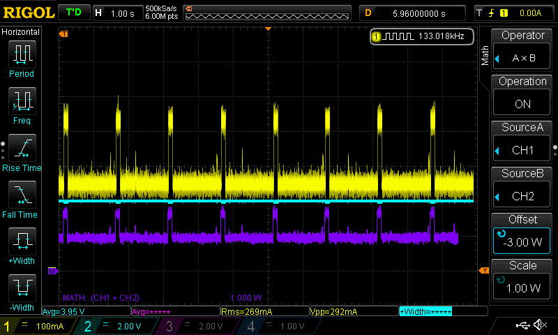
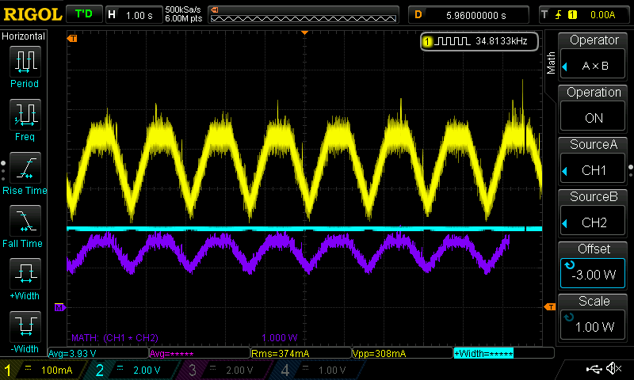
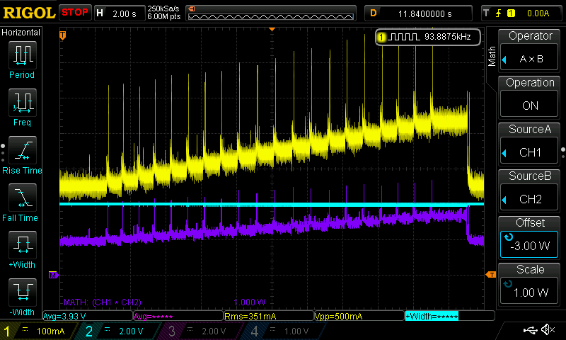

# Current Consumption in TrimUI Brick with NextUI

## Objective

To evaluate the impact of the RGB LEDs on the current consumption of the TrimUI Brick running NextUI. The contribution of the screen backlight and wifi were checked as well.

## Table of Contents
- [Objective](#objective)
- [Test Configuration](#test-configuration)
- [Key Findings](#key-findings)
  - [TOP BAR](#top-bar)
  - [L&R (White)](#lr-white)
  - [F1 (White)](#f1-white)
  - [Comparative Analysis](#comparative-analysis-at-maximum-white-brightness)
- [LED Modes](#led-modes-static-blink-etc)
- [Screen Backlight](#screen-backlight)
- [Wi-Fi](#wi-fi)
- [Test Setup](#test-setup)

## Test Configuration

For testing, the battery was disconnected completely. An 8.87k resistor was soldered across the center battery terminal and GND to present a valid thermistor from the "battery". 4V was supplied from my bench power supply to wires soldered directly to the battery connector on the board. See [test setup](#test-setup) below.

- **Voltage Source**: BK Precision 9130 bench power supply (4.0V)
- **Current Measurement**: Brymen 235 multimeter
- **Oscilloscope**: Rigol DS1054Z (for signal capture)
- **Device**: Trimui Brick NextUI release 4.3.10, device firmware 1.06, board rev 1.0, date code 2024-09-30, wifi disabled, screen backlight minimum
- **Baseline LED settings**: All LEDs set to 0 brightness, 0 info brightness, static, white, 1000 speed

### UPDATE:
Testing continued: [here](./Brick%20Current%20Consumption%20followup.md).

Thermal testing: [thermal testing results](./Brick%20Thermal%20Testing.md).

## Key Findings

### TOP BAR

| Color/Setting     | Current (mA) | Increase from Baseline |
|-------------------|--------------|------------------------|
| 0%                | 234          | -                      |
| Pure Blue (100%)  | 295          | 61 mA (+26%)           |
| Pure Green (100%) | 295          | 61 mA (+26%)           |
| Pure Red (100%)   | 295          | 61 mA (+26%)           |
| White (50%)       | 329          | 95 mA (+41%)           |
| White (100%)      | 417          | 183 mA (+78%)          |

### L&R (White)

| Brightness | Current (mA) | Increase from Baseline |
|------------|--------------|------------------------|
| 0%         | 241          | -                      |
| 50%        | 262          | 21 mA (+9%)            |
| 100%       | 282          | 41 mA (+17%)           |

### F1 (White)

| Brightness | Current (mA) | Increase from Baseline |
|------------|--------------|------------------------|
| 0%         | 241          | -                      |
| 50%        | 265          | 24 mA (+10%)           |
| 100%       | 287          | 46 mA (+19%)           |

**Note:** Changes to F2 key brightness did nothing.

## Comparative Analysis at Maximum White Brightness

| LED Component | Current Increase |
|---------------|------------------|
| TOP BAR       | 78%              |
| L&R           | 17%              |
| F1 Key        | 19%              |

## LED Modes (Static, Blink, etc.)

Below are images of the current consumption in each of the LED operating modes. All captures were done using the TOP BAR set to 100 brightness, 1000 speed, and white. It appears that the brightness setting sets the peak reached in each of these modes.

Yellow: Input current
Blue: Input voltage
Violet: Input Power (math trace calculated from input voltage * input current)

*Figure 1.1: Static mode - TOP BAR, white, 100% brightness, 1000 speed*

*Figure 1.2: Blink 1 mode - TOP BAR, white, 100% brightness, 1000 speed*

*Figure 1.3: Blink 2 mode - TOP BAR, white, 100% brightness, 1000 speed*

*Figure 1.4: Breathe mode - TOP BAR, white, 100% brightness, 1000 speed*

*Figure 1.5: Interval Breathe mode - TOP BAR, white, 100% brightness, 1000 speed*

*Figure 1.6: Linear mode - TOP BAR, white, 100% brightness, 1000 speed*

### Manually Increasing Static

The image below was captured by starting with all LEDs off and increasing the top bar brightness (white) from 0 to 100 roughly every second. The peaks are the device registering and processing button presses, followed by a period where the increased current draw due to the increased LED brightness can be seen.

*Figure 1.7: Manual brightness stepping - TOP BAR, white, increasing from 0% to 100%*

## Key Findings 

1. **Linear Brightness Scaling:** For all tested LED configurations (individual colors and white), the current draw scales linearly with the brightness setting.
2. **Color vs. White Current Draw:** Displaying a single pure color (red, green, or blue) at 100% brightness consumes one-third the current of displaying white light at the same brightness.
3. **LED Locations:** The TOP BAR consumes significantly more power than others, with a 78% increase in system current at maximum white brightness. This tracks with how many LEDs it uses vs the other locations.

## Screen Backlight

The increase in system current consumption goes up considerably in the last step. The additional current draw steps start small and get larger steadily as brightness increases.

| Brightness Step | Current (mA) | Increase from Step 0 |
|-----------------|--------------|----------------------|
| 0               | 241          | -                    |
| 1               | 246          | 5 mA (+2%)           |
| 2               | 250          | 9 mA (+4%)           |
| 3               | 262          | 21 mA (+9%)          |
| 4               | 272          | 31 mA (+13%)         |
| 5               | 288          | 47 mA (+20%)         |
| 6               | 305          | 64 mA (+27%)         |
| 7               | 327          | 86 mA (+36%)         |
| 8               | 351          | 110 mA (+46%)        |
| 9               | 374          | 133 mA (+55%)        |
| 10              | 421          | 180 mA (+75%)        |

 

*Figure 2.1: Screen backlight current consumption across brightness levels 0-10*

## Wi-Fi

Wi-Fi has a relatively small impact on system power consumption:

| Wi-Fi State           | Current (mA) | Increase from Off State |
|-----------------------|--------------|-------------------------|
| Off                   | 240          | -                       |
| On (Disconnected)     | 244          | 4 mA (+2%)              |
| On (Connected)        | 247          | 7 mA (+3%)              |

## Test Setup

 

*Figure 3.1: Test setup overview*

 

*Figure 3.2: Device back view - Red and black wires (lower right) are power connection on battery connector. Orange, yellow, and black wires going to upper left are hardware serial port.*

**Annotated Device Back View Reference:**

| Number | Component Description |
|--------|------------------------|
| 1 | Main regulator (powers CPU, etc) |
| 2 | CPU |
| 3 | Memory (behind the USB-C connector) |
| 4 | 5V boost on back of board in this area (powers LEDs and USB host) |
| 5 | Screen backlight supply |

 

*Figure 3.3: Annotated device back view with component identification*

 

*Figure 3.4: Device battery (disconnected during testing)*
