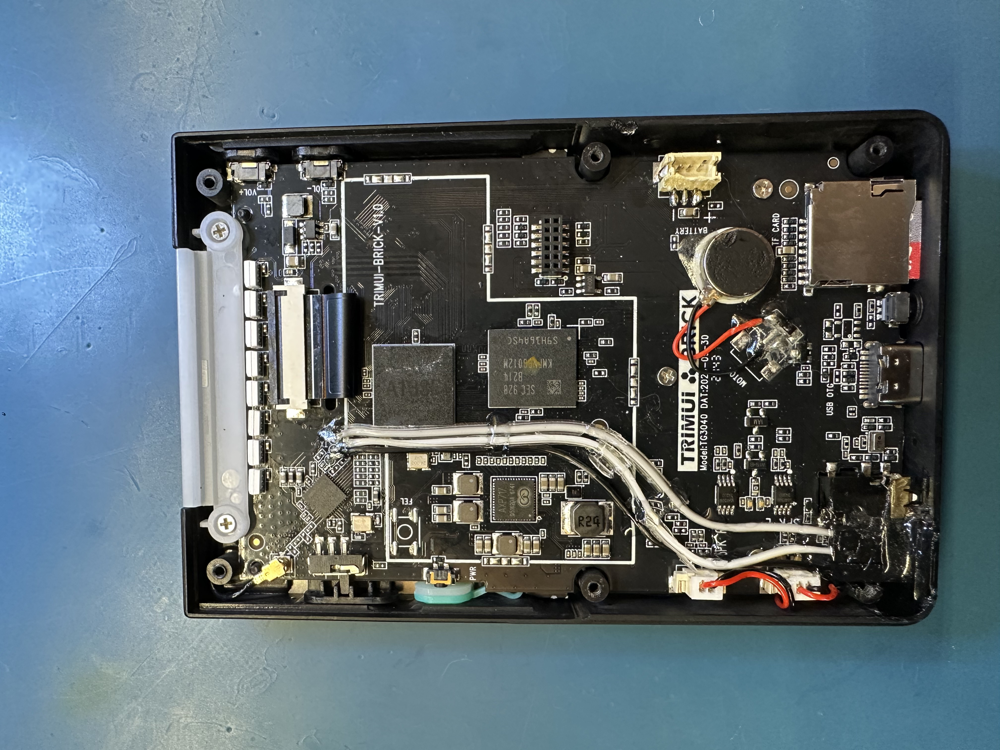
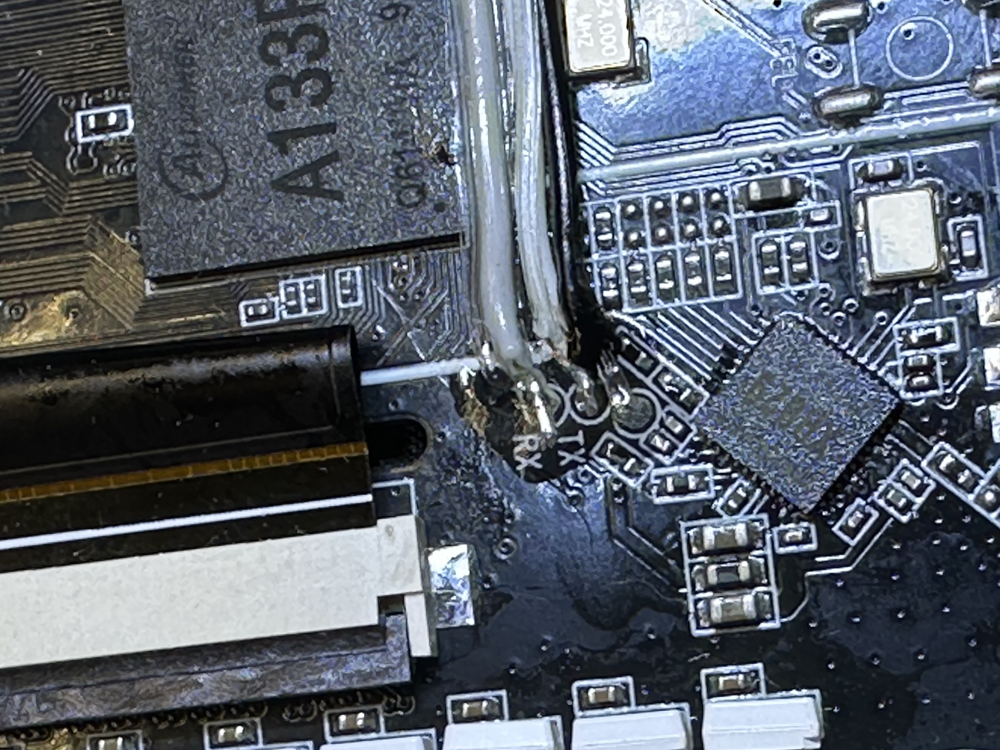
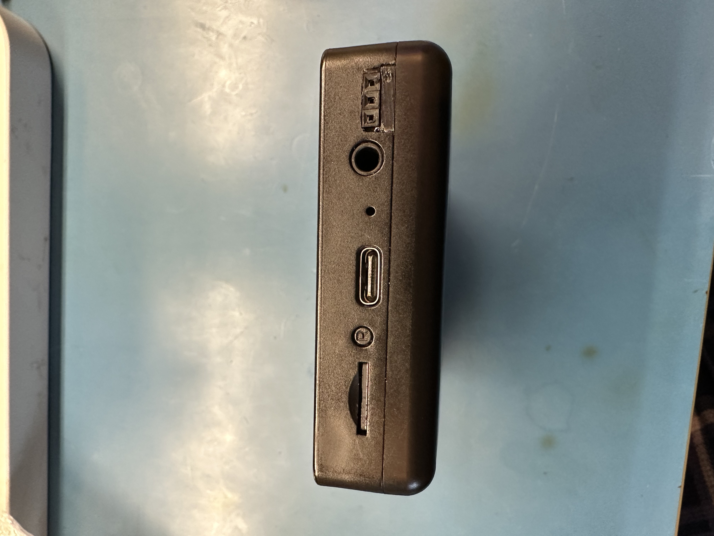
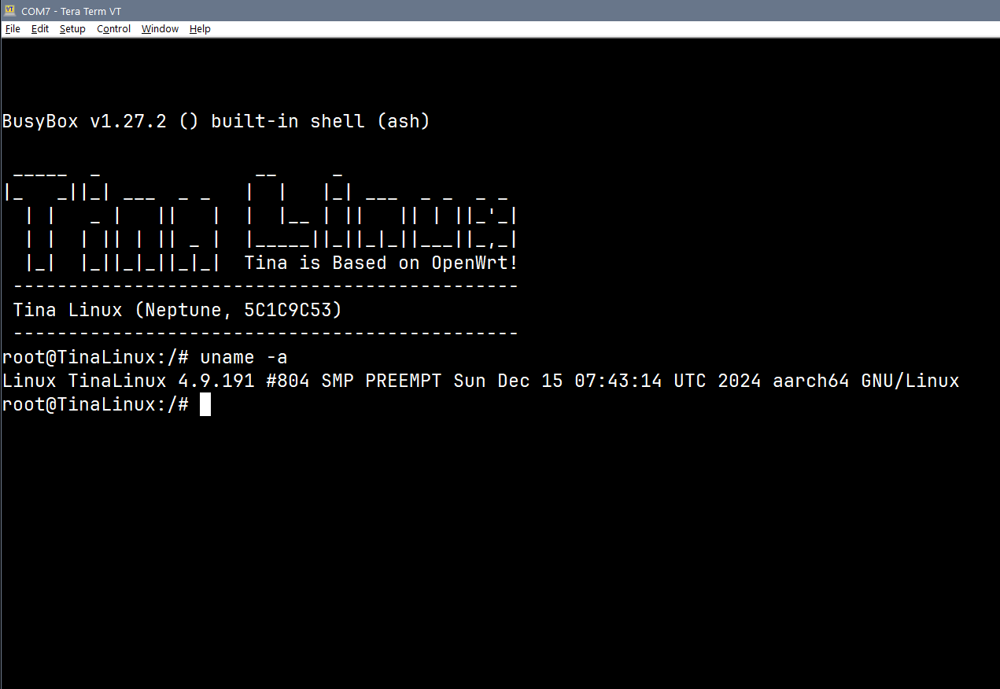

# TrimUI Brick Hardware Debug Interface

## Overview

There are two testpoints labeled TX and RX in the upper left corner (when looking at the back of the device as shown below). There is an additional unmarked testpoint nearby that is connected to GND. These three points present a 3.3V UART interface.

USB to UART adapter used: FTDI TTL-232R-3V3 [Digikey link](https://www.digikey.com/en/products/detail/ftdi-future-technology-devices-international-ltd/TTL-232R-3V3/1836393)

These were wired out to three 0.1" female pin headers inserted into a small cutout I created in the housing. The empty space above the headers was filled with a small 3D printed piece to approximate the lost material. Bondic was used to secure/insulate the solder joints and secure the wires along the PCB. Epoxy was used to hold the headers and 3D printed piece in place and provide some structural help for inserting and removing a mating interface.

This interface can be printed to as:
- /dev/console
- /dev/ttyS0

It also displays messages received at /dev/kmsg (i.e., this interface prints kernel messages).

## Hardware Implementation

*Figure 1.1: Overview of hardware debug interface implementation*

*Figure 1.2: Close-up view of debug interface connection points*

*Figure 1.3: Modified unit with debug interface connected*

*Figure 1.4: Complete hardware debug interface installation*

## Example Output

*Figure 2.1: Example terminal output from the UART debug interface*