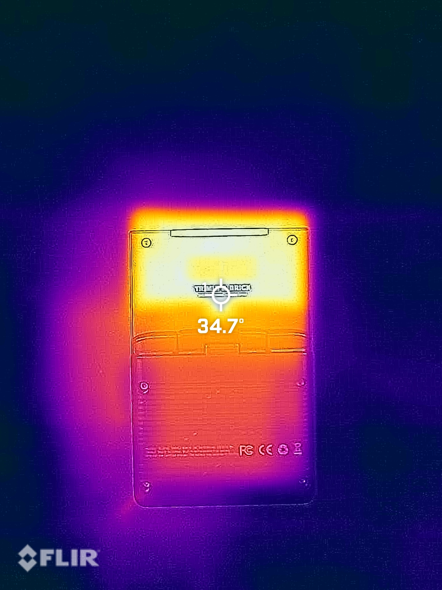

# TrimUI Brick Thermal Testing

These images were taken to help get an idea of the hot-spots and primary contributors to heating in the TrimUI Brick. Images were captured with a Flir One Gen 3.

Unless otherwise noted, all LEDs are set to 0 brightness (off) screen brightness is at minimum, wifi is off, and a static menu item is selected. NextUI release 4.3.15. The battery was connected and powering the device for all thermal testing.

This is a continuation of the [initial Brick current consumption testing](./Brick%20Current%20Consumption%20with%20NextUI.md) and [followup Brick current consumption testing](./Brick%20Current%20Consumption%20followup.md).

## Table of Contents
- [Summary](#summary)
- [Baseline (all LEDs off, min screen brightness)](#baseline-all-leds-off-min-screen-brightness)
- [No LEDs, max screen brightness](#no-leds-max-screen-brightness)
- [All LEDs max, min screen brightness](#all-leds-max-min-screen-brightness)
- [All LEDs EXCEPT TOP BAR max, min screen brightness](#all-leds-except-top-bar-max-min-screen-brightness)
- [TOP BAR LEDs only max, min screen brightness](#top-bar-leds-only-max-min-screen-brightness)
- [SUPA emulator, no LEDs, min screen brightness](#supa-emulator-no-leds-min-screen-brightness)
- [SUPA emulator, max LEDs, max screen brightness](#supa-emulator-max-leds-max-screen-brightness)
- [SUPA emulator, 50 LEDs, 50 screen brightness](#supa-emulator-50-leds-50-screen-brightness)
- [SUPA emulator, 25 LEDs, 30 screen brightness](#supa-emulator-25-leds-30-screen-brightness)
- [Backplate Removed (back of device open)](#backplate-removed-back-of-device-open)

## Summary

Below are the temperature rises found in each test after running for 20 minutes.  Each test is outlined in more detail below.

| Configuration | Temperature Increase |
|---------------|---------------------|
| Baseline (LEDs off, min screen brightness) | +2.5°C |
| No LEDs, max screen brightness | +4.6°C |
| All LEDs max, min screen brightness | +9.0°C |
| TOP BAR LEDs only, min screen brightness | +7.9°C |
| All LEDs except TOP BAR, min screen brightness | +6.2°C |
| SUPA emulator, no LEDs, min screen brightness | +6.3°C |
| SUPA emulator, max LEDs, max screen brightness | +16.2°C |
| SUPA emulator, 50% LEDs, 50% screen brightness | +11.8°C |
| SUPA emulator, 25% LEDs, 30% screen brightness | +8.4°C |

## Baseline (all LEDs off, min screen brightness)

This testing was done with all LEDs off, screen brightness minimum, wifi off, on a static menu item.

| Time (minutes) | Temp (°C) | Temp Rise (°C) |
|----------------|-----------|----------------|
| 0              | 28.0      | 0.0            |
| 5              | 29.4      | 1.4            |
| 20             | 30.5      | 2.5            |

*Figure 1.1: T = 0 minutes - Baseline (all LEDs off, min screen brightness)*

*Figure 1.2: T = 5 minutes - Baseline (all LEDs off, min screen brightness)*

*Figure 1.3: T = 20 minutes - Baseline (all LEDs off, min screen brightness)*

## No LEDs, max screen brightness

This testing was done with all LEDs off, screen brightness maximum, wifi off, on a static menu item.

| Time (minutes) | Temp (°C) | Temp Rise (°C) |
|----------------|-----------|----------------|
| 0              | 28.1      | 0.0            |
| 5              | 29.0      | 0.9            |
| 20             | 32.7      | 4.6            |

*Figure 2.1: T = 0 minutes - No LEDs, max screen brightness*

*Figure 2.2: T = 5 minutes - No LEDs, max screen brightness*

*Figure 2.3: T = 20 minutes - No LEDs, max screen brightness*

## All LEDs max, min screen brightness

This testing had all LEDs enabled, set to static white with 100 brightness and info brightness, screen brightness minimum.

| Time (minutes) | Temp (°C) | Temp Rise (°C) |
|----------------|-----------|----------------|
| 0              | 28.1      | 0.0            |
| 5              | 33.5      | 5.4            |
| 20             | 37.1      | 9.0            |

*Figure 3.1: T = 0 minutes - All LEDs max, min screen brightness*

*Figure 3.2: T = 5 minutes - All LEDs max, min screen brightness*

*Figure 3.3: T = 20 minutes - All LEDs max, min screen brightness*

## All LEDs EXCEPT TOP BAR max, min screen brightness

This testing had all LEDs except the TOP BAR enabled, set to static white with 100 brightness and info brightness. The TOP BAR LEDs are set to 0 brightness. Screen brightness minimum.

| Time (minutes) | Temp (°C) | Temp Rise (°C) |
|----------------|-----------|----------------|
| 0              | 27.9      | 0.0            |
| 5              | 31.4      | 3.5            |
| 20             | 34.1      | 6.2            |

*Figure 4.1: T = 0 minutes - All LEDs EXCEPT TOP BAR max, min screen brightness*

*Figure 4.2: T = 5 minutes - All LEDs EXCEPT TOP BAR max, min screen brightness*

*Figure 4.3: T = 20 minutes - All LEDs EXCEPT TOP BAR max, min screen brightness*

## TOP BAR LEDs only max, min screen brightness

This testing had all LEDs except the TOP BAR disabled. The TOP BAR is set to static white with 100 brightness and info brightness. Screen brightness minimum.

| Time (minutes) | Temp (°C) | Temp Rise (°C) |
|----------------|-----------|----------------|
| 0              | 26.8      | 0.0            |
| 5              | 31.8      | 5.0            |
| 20             | 34.7      | 7.9            |

*Figure 5.1: T = 0 minutes - TOP BAR LEDs only max, min screen brightness*

*Figure 5.2: T = 5 minutes - TOP BAR LEDs only max, min screen brightness*

*Figure 5.3: T = 20 minutes - TOP BAR LEDs only max, min screen brightness*

## SUPA emulator, no LEDs, min screen brightness

This testing had all LEDs disabled, screen brightness minimum, and let the title screen to loop for Super Mario World emulated with SUPA. All emulator settings default.

This game/emulator was chosen because it was the highest power consumption of those tested in my in-game current consumption testing linked at the top.

| Time (minutes) | Temp (°C) | Temp Rise (°C) |
|----------------|-----------|----------------|
| 0              | 27.9      | 0.0            |
| 5              | 31.6      | 3.7            |
| 20             | 34.2      | 6.3            |

*Figure 6.1: T = 0 minutes - SUPA emulator, no LEDs, min screen brightness*

*Figure 6.2: T = 5 minutes - SUPA emulator, no LEDs, min screen brightness*

*Figure 6.3: T = 20 minutes - SUPA emulator, no LEDs, min screen brightness*

## SUPA emulator, max LEDs, max screen brightness

This testing had all LEDs enabled and set to white, static, 100 brightness and info brightness. Screen brightness is set to maximum.

This game/emulator was chosen because it was the highest power consumption of those tested in my in-game current consumption testing linked at the top.

| Time (minutes) | Temp (°C) | Temp Rise (°C) |
|----------------|-----------|----------------|
| 0              | 27.9      | 0.0            |
| 5              | 36.8      | 8.9            |
| 20             | 44.1      | 16.2           |

*Figure 7.1: T = 0 minutes - SUPA emulator, max LEDs, max screen brightness*

*Figure 7.2: T = 5 minutes - SUPA emulator, max LEDs, max screen brightness*

*Figure 7.3: T = 20 minutes - SUPA emulator, max LEDs, max screen brightness*

## SUPA emulator, 50 LEDs, 50 screen brightness

This testing had all LEDs enabled and set to white, static, 50 brightness and info brightness. Screen brightness is set to 50%.

This game/emulator was chosen because it was the highest power consumption of those tested in my in-game current consumption testing linked at the top.

| Time (minutes) | Temp (°C) | Temp Rise (°C) |
|----------------|-----------|----------------|
| 0              | 28.1      | 0.0            |
| 5              | 34.1      | 6.0            |
| 20             | 39.9      | 11.8           |

*Figure 8.1: T = 0 minutes - SUPA emulator, 50 LEDs, 50 screen brightness*

*Figure 8.2: T = 5 minutes - SUPA emulator, 50 LEDs, 50 screen brightness*

*Figure 8.3: T = 20 minutes - SUPA emulator, 50 LEDs, 50 screen brightness*

## SUPA emulator, 25 LEDs, 30 screen brightness

This testing had all LEDs enabled and set to white, static, 25 brightness and info brightness. Screen brightness is set to 30%.

This game/emulator was chosen because it was the highest power consumption of those tested in my in-game current consumption testing linked at the top.

| Time (minutes) | Temp (°C) | Temp Rise (°C) |
|----------------|-----------|----------------|
| 0              | 28.1      | 0.0            |
| 5              | 32.4      | 4.3            |
| 20             | 36.5      | 8.4            |

*Figure 9.1: T = 0 minutes - SUPA emulator, 25 LEDs, 30 screen brightness*

*Figure 9.2: T = 5 minutes - SUPA emulator, 25 LEDs, 30 screen brightness*

*Figure 9.3: T = 20 minutes - SUPA emulator, 25 LEDs, 30 screen brightness*

## Backplate Removed (back of device open)

These were captured while the device was disassembled to get a better idea of the specific components contributing heat. 

Below images are with all LEDs disabled, static.

*Figure 10.1: Before start (device off) - Backplate removed, all LEDs disabled*

*Figure 10.2: T = 10 minutes - Backplate removed, all LEDs disabled, hotspot=38.7°C*

Below images are with TOP BAR LEDs set to 100 brightness, static.
Device was cooled to ambient before starting this test (same as 'before start' above).

*Figure 10.3: T = 10 minutes - Backplate removed, TOP BAR LEDs at 100 brightness, CPU hotspot=38.6°C*

*Figure 10.4: T = 10 minutes - Backplate removed, TOP BAR LEDs at 100 brightness, TOP BAR LEDs hotspot=44.2°C*
