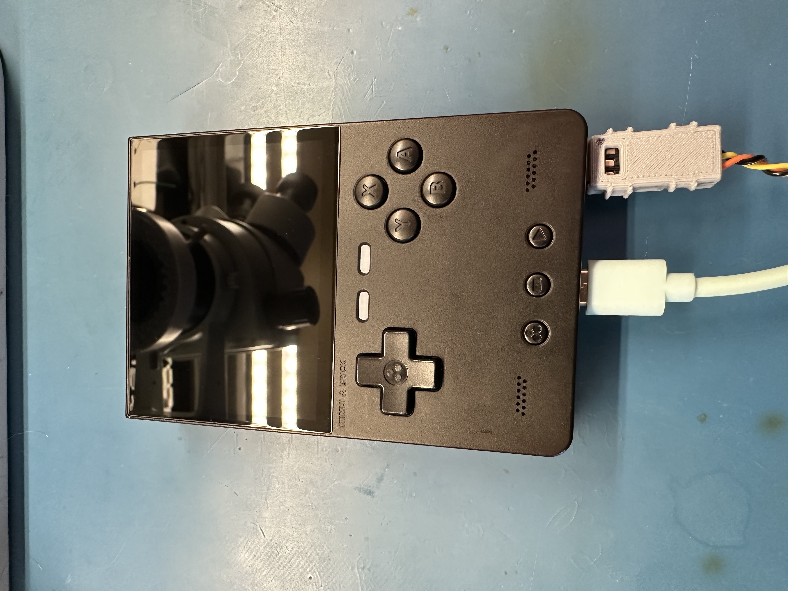

# TrimUI Brick Hardware Testing

This repository contains testing results for the TrimUI Brick, focusing on current consumption, battery life, and thermal performance.

*Figure 1: TrimUI Brick with USB and hardware serial interface added and connected*

## Key Findings
- The device's battery life is significantly affected by screen brightness and RGB LED settings, with the TOP BAR LEDs having the biggest impact. 
    - TOP BAR LEDs alone can reduce battery life by over 40%
    - All LEDs combined can reduce battery life by over 50%.
- Similarly, the LEDs contribute substantially to the device heating.
    - LEDs alone can have a larger impact than gaming
- WiFi has minimal impact.
- For optimal battery life and thermal management, use 25% or lower LED brightness and 30% or lower screen brightness. 

## Contents

### Summary Report
- [TrimUI Brick: Current Consumption and Thermal Data](TrimUI%20Brick%20Current%20Consumption%20and%20Thermal%20Data.md) - Condensed overview of all testing, key findings, and recommendations

### Detailed Test Reports
- [Brick Current Consumption with NextUI](Brick%20Current%20Consumption%20with%20NextUI.md) - Initial testing focusing on RGB LEDs, screen backlight, and WiFi
- [Brick Current Consumption Followup](Brick%20Current%20Consumption%20followup.md) - Additional testing on device modes (off, sleep) and various emulators
- [Brick Thermal Testing](Brick%20Thermal%20Testing.md) - Thermal imaging tests across various configurations
- [Brick Hardware Debug](Brick%20Hardware%20Debug.md) - Documentation of the hardware debug interface

## Hardware Specifications
- TrimUI Brick TG3040
- 3000mAh (11.1Wh) battery
- NextUI 4.3.10, NextUI 4.3.15, STOCK OS 1.06 (see individual test documents)
- Board Revision 1.0
- Board Date Code: 2024-09-30

## Test Configuration
Tests were conducted using a BK Precision 9130 bench power supply, Brymen 235 multimeter, and Rigol DS1054Z oscilloscope. Thermal imaging was performed using a Flir One Gen 3 camera.

## License
This repository and all documentation are provided under [MIT License](LICENSE).